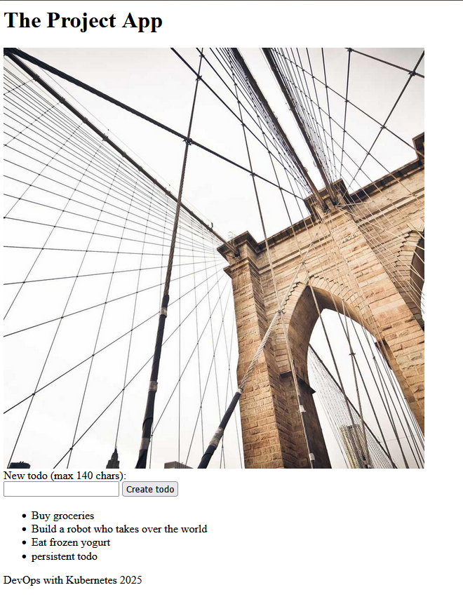

# The Project

This is a project to learn kubernetes from the MOOC.fi course "DevOps with Kubernetes".

## Getting Started

1. Make a k3d local registry for image storage
```bash
k3d registry create local-registry --port 5000
```

2. Make sure your local k3d cluster is running
```bash
k3d cluster create --port 8082:30080@agent:0 -p 8081:80@loadbalancer --agents 2 --registry-use k3d-local-registry:5000
```

3. Create the project namespace

```bash
kubectl apply -f ../namespaces/project.yaml
kubens project
```

4. Create the required resources using kubectl

```bash
docker build -f Dockerfile.app -t todo-app:latest .
docker build -f Dockerfile.backend -t todo-backend:latest .
docker tag todo-app:latest localhost:5000/todo-app:latest
docker tag todo-backend:latest localhost:5000/todo-backend:latest
docker push localhost:5000/todo-app:latest
docker push localhost:5000/todo-backend:latest

kubectl apply -f ../volumes/theprojectpv.yaml
kubectl apply -f ../volumes/theprojectpvc.yaml
kubectl apply -f manifests/
```

> [!NOTE]
> Note that the images are tagged as `localhost:5000` when pushing from the host machine, but the Kubernetes manifests reference them as `k3d-local-registry:5000` since that's the internal cluster DNS name.

5. Access the application via Ingress

The application is accessed through the ingress controller. Visit:

```
http://localhost:8081
```


